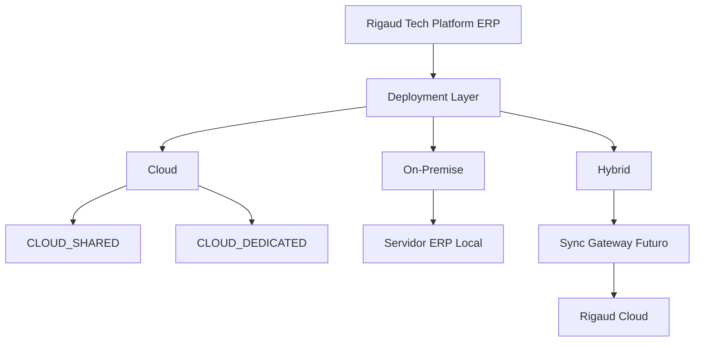

# Deployment Architecture

DOC-008 congela a arquitetura oficial de distribuicao e infraestrutura da Rigaud Tech Platform ERP.

## Decisao Central

Tenant e deployment sao conceitos diferentes.

```text
Tenant = empresa cliente
Deployment = ambiente tecnico onde um ou mais tenants executam
```

O `tenant_id` continua sendo `companies.id` e deve permanecer estavel em migracoes entre Cloud, On-Premise e Hybrid sempre que tecnicamente possivel.

## Tipos De Deployment

- `CLOUD_SHARED`: varios tenants no mesmo deployment compartilhado.
- `CLOUD_DEDICATED`: deployment dedicado para um tenant ou grupo controlado.
- `ON_PREMISE`: deployment local no ambiente do cliente.
- `HYBRID`: servidor local sincronizando dados/eventos selecionados com Rigaud Cloud.

## Regras Permanentes

- Usuario comum nao escolhe empresa no login.
- Login resolve usuario, tenant/company, filial, role, permissions e access scope no backend.
- Isolamento por tenant e obrigatorio em qualquer deployment.
- Deployment nao cria nova empresa automaticamente.
- Partner/reseller nao e tenant.
- Plataformas Web, Android, iOS, Windows, macOS e Linux acessam o mesmo ERP.
- Servidor de producao recomendado para On-Premise e Linux.

## Fluxo Mestre



## Referencias Consultadas

- Microsoft Azure Architecture Center - Tenancy models for a multitenant solution: https://learn.microsoft.com/en-us/azure/architecture/guide/multitenant/considerations/tenancy-models
- Microsoft Azure Architecture Center - Deployment Stamps pattern: https://learn.microsoft.com/en-us/azure/architecture/patterns/deployment-stamp
- Microsoft Azure Architecture Center - Hybrid and adaptive cloud architecture: https://learn.microsoft.com/en-us/azure/architecture/hybrid/hybrid-start-here
- Odoo Hosting: https://www.odoo.com/documentation/17.0/administration/hosting.html
- Odoo Point of Sale: https://www.odoo.com/documentation/19.0/applications/sales/point_of_sale.html
- Odoo Manufacturing: https://www.odoo.com/documentation/18.0/applications/inventory_and_mrp/manufacturing.html
- ERPNext Documentation: https://docs.erpnext.com/index
- ERPNext Stock Transactions: https://docs.frappe.io/erpnext/stock-transactions
- ERPNext Point of Sale: https://docs.frappe.io/erpnext/point-of-sale
