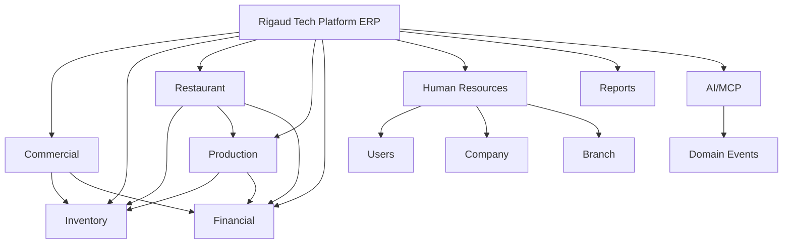

# System Map

Mapa funcional oficial da Rigaud Tech Platform ERP.

## Decisoes

- Production Engine e independente do Restaurant.
- Restaurant utiliza Production e Inventory.
- Financial integra Sales, Inventory, Restaurant e Production.
- HR e independente, mas integrado a Users, Company e Branch.
- AI/MCP consome eventos e ferramentas de dominio, sem alterar dados transacionais sem workflow explicito, auditoria e permissao.

## Arquitetura Viva

Este mapa deve ser atualizado quando uma task alterar arquitetura funcional, limites de modulo ou relacoes entre engines.
