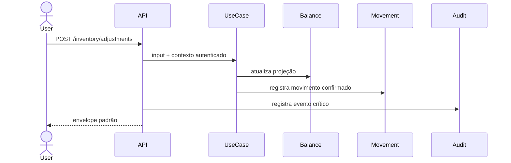

# Inventory Endpoints

Base path:

```text
/api/v1/inventory
```

## GET /balances

Consulta saldos projetados.

Query:

- `page`;
- `page_size`;
- `branch_id` opcional;
- `product_id` opcional.

Retorna `InventoryBalance`.

## GET /movements

Consulta histórico de movimentações.

Query:

- `page`;
- `page_size`;
- `branch_id` opcional;
- `product_id` opcional.

Retorna `InventoryMovement`.

## POST /adjustments

Registra ajuste manual ou técnico.

Payload:

```json
{
  "product_id": "uuid",
  "adjustment_type": "increase",
  "quantity": "10.000",
  "reason": "Entrada inicial",
  "notes": "opcional"
}
```

Tipos:

- `increase`;
- `decrease`.

## POST /reservations

Registra reserva lógica de estoque disponível.

Payload:

```json
{
  "product_id": "uuid",
  "quantity": "2.000",
  "reason": "Pedido em aberto",
  "source_module": "restaurant",
  "source_id": "uuid"
}
```

Reserva não altera saldo físico.

## POST /reservations/{reservation_id}/release

Libera uma reserva ativa.

Gera movimento `reservation_released` e reduz `reserved_quantity`.

## Fluxo


