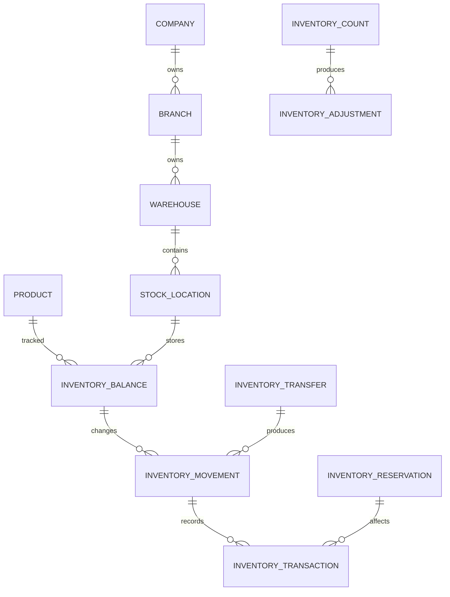
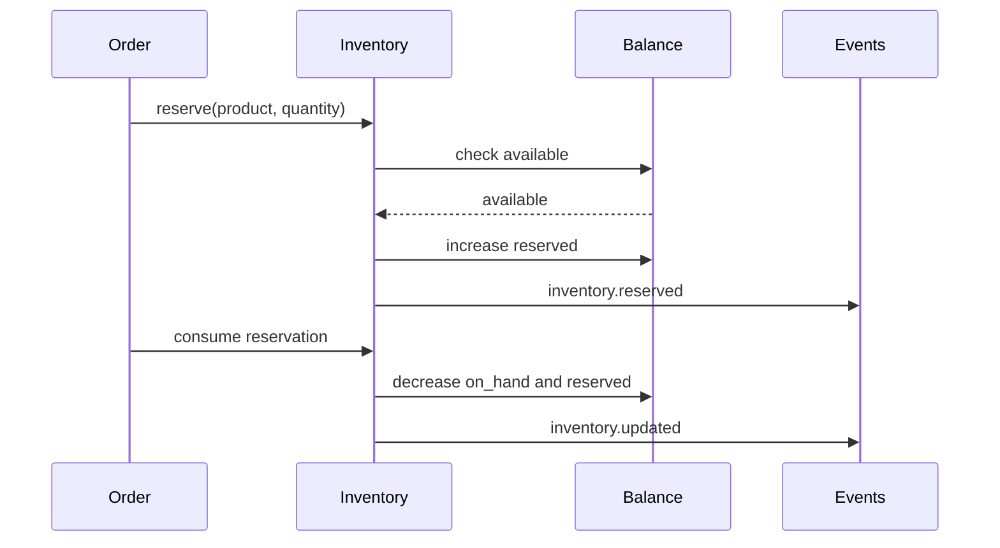
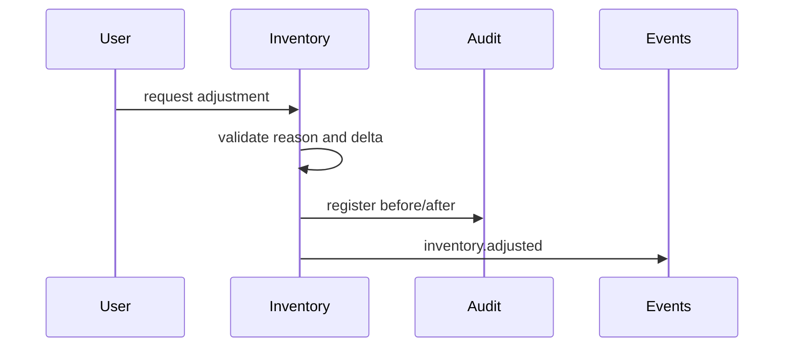
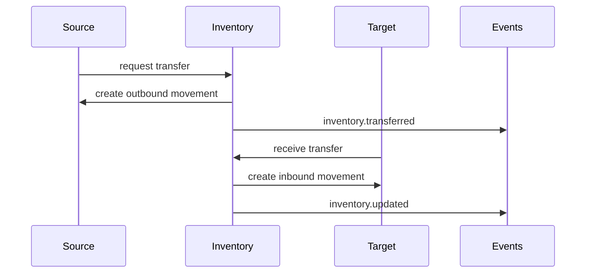

# Fluxos E Diagramas

## Modelo Alto Nível

```mermaid
erDiagram
    COMPANY ||--o{ BRANCH : owns
    BRANCH ||--o{ WAREHOUSE : owns
    WAREHOUSE ||--o{ STOCK_LOCATION : contains
    PRODUCT ||--o{ INVENTORY_BALANCE : tracked
    STOCK_LOCATION ||--o{ INVENTORY_BALANCE : stores
    INVENTORY_BALANCE ||--o{ INVENTORY_MOVEMENT : changes
    INVENTORY_MOVEMENT ||--o{ INVENTORY_TRANSACTION : records
    INVENTORY_RESERVATION ||--o{ INVENTORY_TRANSACTION : affects
    INVENTORY_COUNT ||--o{ INVENTORY_ADJUSTMENT : produces
    INVENTORY_TRANSFER ||--o{ INVENTORY_MOVEMENT : produces
```

## Reserva E Consumo

```mermaid
sequenceDiagram
    participant Order
    participant Inventory
    participant Balance
    participant Events

    Order->>Inventory: reserve(product, quantity)
    Inventory->>Balance: check available
    Balance-->>Inventory: available
    Inventory->>Balance: increase reserved
    Inventory->>Events: inventory.reserved
    Order->>Inventory: consume reservation
    Inventory->>Balance: decrease on_hand and reserved
    Inventory->>Events: inventory.updated
```

## Ajuste

```mermaid
sequenceDiagram
    participant User
    participant Inventory
    participant Audit
    participant Events

    User->>Inventory: request adjustment
    Inventory->>Inventory: validate reason and delta
    Inventory->>Audit: register before/after
    Inventory->>Events: inventory.adjusted
```

## Transferência

```mermaid
sequenceDiagram
    participant Source
    participant Inventory
    participant Target
    participant Events

    Source->>Inventory: request transfer
    Inventory->>Source: create outbound movement
    Inventory->>Events: inventory.transferred
    Target->>Inventory: receive transfer
    Inventory->>Target: create inbound movement
    Inventory->>Events: inventory.updated
```

