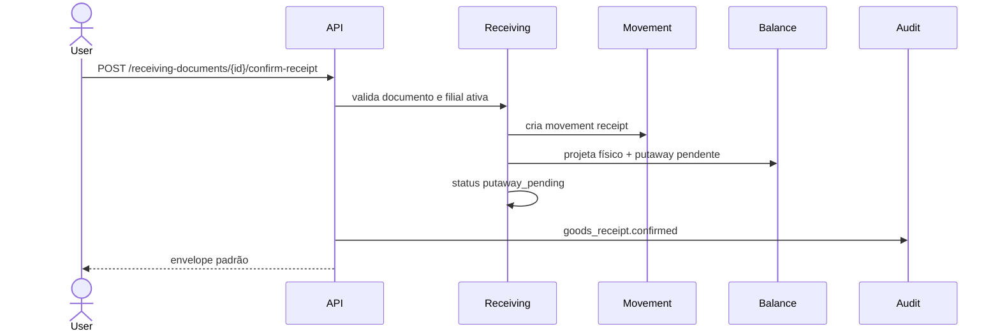

# Goods Receipt

REST-008 implementa a confirmação física de mercadorias recebidas.

O Goods Receipt parte de um `ReceivingDocument` já cadastrado e confirma as quantidades recebidas nos itens do documento.

## Escopo

Implementado:

- `GoodsReceiptService`;
- endpoint de confirmação;
- geração de `InventoryMovement` do tipo `receipt`;
- atualização da projeção `InventoryBalance`;
- status `putaway_pending`;
- quantidade física recebida como pendente de put away;
- auditoria;
- evento interno preparado para Kafka;
- Flutter com confirmação no detalhe do recebimento.

Fora do escopo:

- put away para localização final;
- regras automáticas de endereçamento;
- inspeção de qualidade;
- integração financeira;
- fornecedor real.

## Fluxo



## Regra De Disponibilidade

Ao confirmar o recebimento:

```text
physical_quantity += received_quantity
putaway_pending_quantity += received_quantity
available_quantity = physical_quantity - reserved_quantity - putaway_pending_quantity
```

Assim, a mercadoria recebida existe fisicamente, mas ainda não fica disponível para venda ou consumo até a REST-009 concluir o Put Away.

## Endpoint

```text
POST /api/v1/receiving-documents/{document_id}/confirm-receipt
```

Payload:

```json
{
  "notes": "Conferencia fisica concluida"
}
```

Resposta:

- documento atualizado;
- saldos atualizados;
- movimentos gerados.

## Referências Consultadas

- FastAPI APIRouter e organização em múltiplos arquivos: https://fastapi.tiangolo.com/tutorial/bigger-applications/
- SQLAlchemy asyncio: https://docs.sqlalchemy.org/en/latest/orm/extensions/asyncio.html
- Alembic asyncio cookbook: https://alembic.sqlalchemy.org/en/latest/cookbook.html
- PostgreSQL constraints: https://www.postgresql.org/docs/current/ddl-constraints.html
- PostgreSQL indexes: https://www.postgresql.org/docs/current/sql-createindex.html
- SAP EWM Goods Receipt e Putaway: https://help.sap.com/docs/SAP_S4HANA_ON-PREMISE/25a41481f62e469ba0e61015a0d39d20/918cbf53f106b44ce10000000a174cb4.html
- SAP EWM Warehouse Tasks for Putaway: https://help.sap.com/docs/PRODUCT_ID/3d97bec9bf1649099384bb8167df3cf2/ffc7cb53ad377114e10000000a174cb4.html
- Microsoft Dynamics 365 Business Central receive and put away: https://learn.microsoft.com/en-us/training/modules/receive-put-away-items/
- Microsoft Business Central warehouse put-away: https://learn.microsoft.com/en-us/dynamics365/business-central/warehouse-how-to-put-items-away-with-warehouse-put-aways
- Odoo Putaway Rules: https://www.odoo.com/documentation/19.0/applications/inventory_and_mrp/inventory/shipping_receiving/daily_operations/putaway.html
- ERPNext Stock Entry: https://docs.frappe.io/erpnext/stock-entry

## Decisão Arquitetural

Goods Receipt confirma estoque físico, mas mantém a quantidade recebida como `putaway_pending_quantity`.

O saldo disponível só será liberado na REST-009, quando o Put Away mover a mercadoria para a localização final.

## Impacto Futuro

Essa separação prepara:

- inspeção de qualidade;
- endereçamento automático;
- leitura por QR Code ou código de barras;
- FEFO/FIFO;
- estoque de recebimento separado do estoque disponível;
- integração com compras, financeiro e fiscal.
