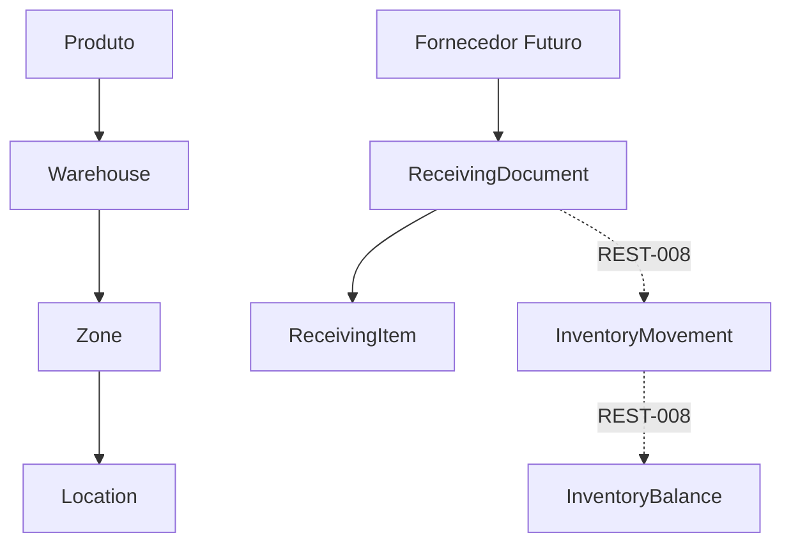

# Receiving Documents

REST-007 implementa documentos de recebimento como a primeira etapa da logística de entrada.

O documento registra a chegada planejada ou iniciada de mercadorias, seus itens e seu status operacional.

## Escopo

Implementado:

- `ReceivingDocument`;
- `ReceivingItem`;
- CRUD completo;
- mudança de status;
- validação de quantidades;
- multi-tenant;
- multi-filial;
- soft delete;
- auditoria;
- envelope padrão;
- catálogo central de mensagens;
- telas Flutter para lista, cadastro, edição e detalhe;
- dados demo para restaurante e varejo.

Fora do escopo:

- criação de `InventoryMovement`;
- alteração de `InventoryBalance`;
- conferência física final;
- put away;
- vínculo real com fornecedor.

## Status

- `draft`: rascunho.
- `expected`: mercadoria esperada.
- `receiving`: recebimento em andamento.
- `partial`: recebimento parcial.
- `received`: documento recebido.
- `cancelled`: documento cancelado.

## Regra Crítica

Recebimento documental não movimenta estoque.

Somente a task REST-008 poderá confirmar entrada física e gerar `InventoryMovement`.

