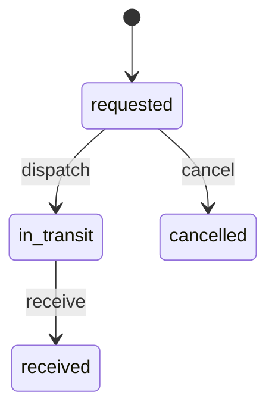

# Inventory Transfers

REST-013 implementa a transferência interna de um produto entre depósitos do mesmo tenant.

## Fluxo



Solicitar não cria movimento nem altera saldo. Despachar cria um `transfer_out` na origem e reduz sua projeção de saldo. Receber cria um `transfer_in` no destino e aumenta sua projeção. Os dois movimentos apontam para o mesmo documento e são imutáveis.

## Regras

- origem e destino pertencem ao mesmo tenant;
- depósitos e localizações precisam estar ativos e pertencer à filial declarada;
- o despacho exige saldo disponível, sem consumir quantidade reservada ou pendente de put away;
- expedição usa a filial de origem ativa e recebimento usa a filial de destino ativa;
- somente transferências não expedidas podem ser canceladas;
- recebimento parcial, divergência, rota e estoque em trânsito explícito são evoluções futuras.

## Endpoints

```text
GET  /api/v1/inventory/transfers
POST /api/v1/inventory/transfers
POST /api/v1/inventory/transfers/{transfer_id}/dispatch
POST /api/v1/inventory/transfers/{transfer_id}/receive
POST /api/v1/inventory/transfers/{transfer_id}/cancel
```

Eventos internos: `inventory.transfer.requested`, `inventory.transfer.dispatched`, `inventory.transfer.received` e `inventory.transfer.cancelled`.

## Referências

- [Microsoft Business Central: transfer orders](https://learn.microsoft.com/en-gb/dynamics365/business-central/inventory-how-transfer-between-locations)
- [Odoo: inter-warehouse transfers](https://www.odoo.com/documentation/16.0/applications/inventory_and_mrp/inventory/warehouses_storage/replenishment/warehouse_replenishment_transfer.html)
