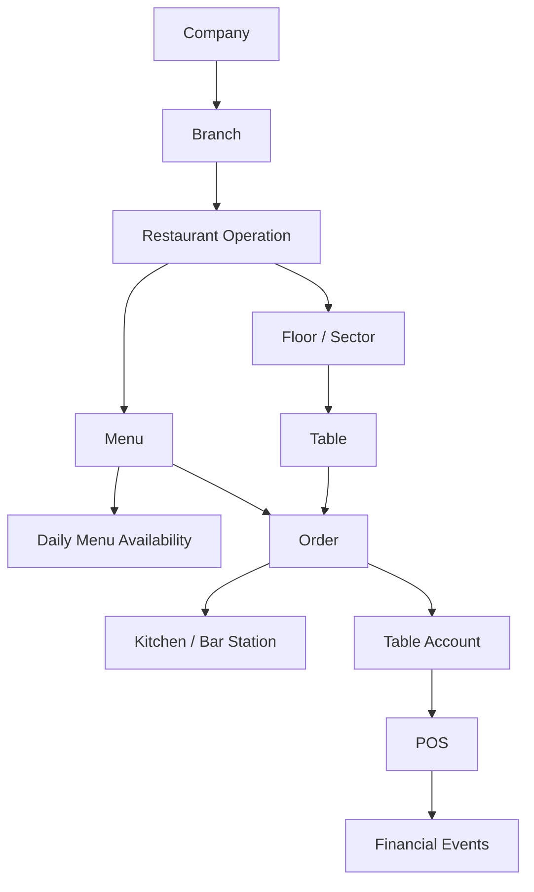

# Restaurant Operations Core

## Objetivo

O núcleo operacional atenderá Restaurante, Bar, Lanchonete, Café, Pizzaria, Food Truck e Delivery a partir de uma configuração por filial. O segmento habilita capacidades e experiências, sem duplicar produtos, estoque, pedidos ou usuários.

## Modelo de domínio planejado

`Restaurant Operation` será a configuração por filial: segmento, modalidades de atendimento, salões, estações e canais habilitados. A nomenclatura `Floor` e `Sector` será refinada na RESTAURANT-001/002 sem criar duas fontes para a mesma área física.

## Capacidades por segmento

| Capacidade | Restaurante/Bar | Lanchonete/Café | Pizzaria | Food Truck | Delivery |
| --- | --- | --- | --- | --- | --- |
| Salão e mesas | opcional | opcional | opcional | não obrigatório | não obrigatório |
| Pedido de balcão | opcional | principal | opcional | principal | não aplicável |
| Estação de preparo | cozinha/bar | cozinha/bar | cozinha | cozinha reduzida | cozinha/expedição |
| QR/menu online | opcional | opcional | opcional | opcional | canal próprio futuro |
| PDV/caixa | futuro | futuro | futuro | futuro | futuro |

## Limites desta fase

- `InventoryBalance` não é alterado pela publicação do menu nem pela quantidade comercial;
- receitas, produção diária, consumo de insumos, perdas e forecast pertencem à EPIC-RESTAURANT-PRODUCTION;
- NFC-e, impostos, pagamento e financeiro serão acionados somente nas tasks próprias;
- um pedido será a fonte operacional comum para garçom, cliente, KDS, impressão e caixa futuros.

## Referências consultadas

- [Odoo Restaurant features](https://www.odoo.com/documentation/18.0/applications/sales/point_of_sale/restaurant.html)
- [ERPNext Restaurant Order Entry](https://docs.frappe.io/erpnext/order-entry)
- [Odoo Self-ordering](https://www.odoo.com/documentation/saas-18.4/applications/sales/point_of_sale/self_order.html)
