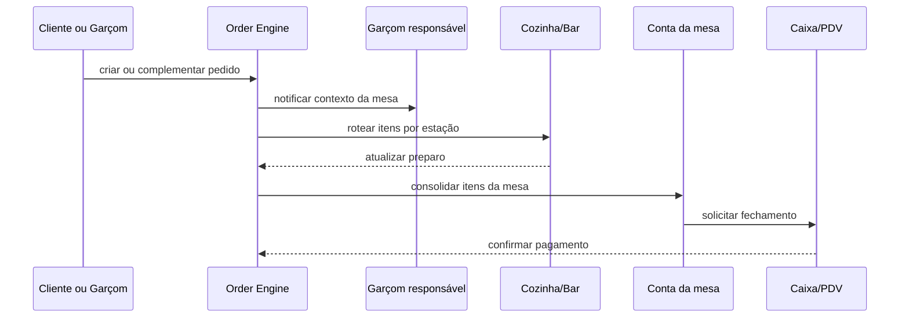

# Fluxo de Pedido Planejado

## Regras congeladas

1. Um pedido pode nascer do garçom, do cliente por QR, de balcão ou de delivery, mas usa o mesmo núcleo e eventos.
2. Pedido de mesa sempre carrega a mesa, o canal e, quando definido, o responsável da mesa.
3. O roteamento para cozinha/bar será por estação configurada e categoria/produto, nunca por lógica fixa na interface.
4. Impressão e KDS serão consumidores do mesmo evento de pedido; não haverá dois fluxos de preparo.
5. A baixa automática de insumos só será definida com Recipe Engine e Restaurant Production.
6. Conta, pagamento, cupom e fiscal permanecem etapas posteriores e não são antecipados pelo cadastro de mesas.
