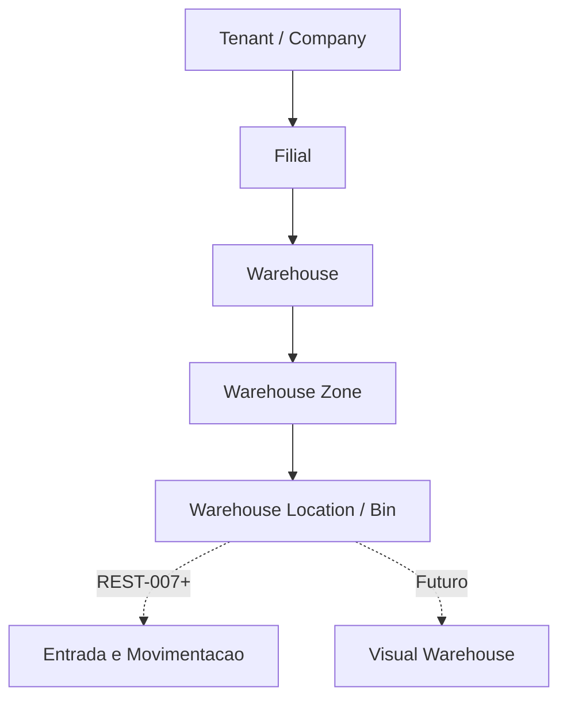

# Warehouse Locations

REST-006 implementa o cadastro de localizações físicas do depósito.

No glossário do ERP, `WarehouseLocation` representa o `Stock Location` ou `Bin` operacional.

Hierarquia oficial:

```text
Company
  -> Branch
  -> Warehouse
  -> Warehouse Zone
  -> Warehouse Location
  -> Inventory
```

## Escopo

Implementado:

- CRUD de localizações;
- ativação e inativação explícitas;
- ordenação por `sort_order`;
- filtros por depósito, zona e pesquisa textual;
- campos preparados para QR Code e código de barras;
- soft delete;
- auditoria;
- API com envelope padrão;
- telas Flutter para lista, cadastro, edição e detalhe;
- dados demo para restaurante e varejo.

Fora do escopo:

- leitura por câmera;
- geração automática de QR Code;
- mapa visual do depósito;
- regras de FEFO, FIFO, LIFO, lote e validade;
- entrada de mercadoria;
- picking e put away.

## Regras

- Toda localização pertence a um tenant, filial, depósito e zona.
- O backend resolve tenant e filial ativa pelo usuário autenticado.
- O frontend informa `warehouse_id` e `zone_id`.
- O depósito precisa pertencer ao tenant e à filial ativa.
- A zona precisa pertencer ao mesmo depósito e estar ativa.
- `code` é único por tenant e depósito entre localizações não removidas.
- `barcode` e `qr_code` são únicos por tenant quando informados.

## Preparação Evolutiva

Cada localização já nasce preparada para:

- QR Code;
- código de barras;
- auditoria completa;
- eventos internos futuros;
- operação multi-filial;
- SaaS e On-Premise;
- sincronização offline futura.

## Fluxo


