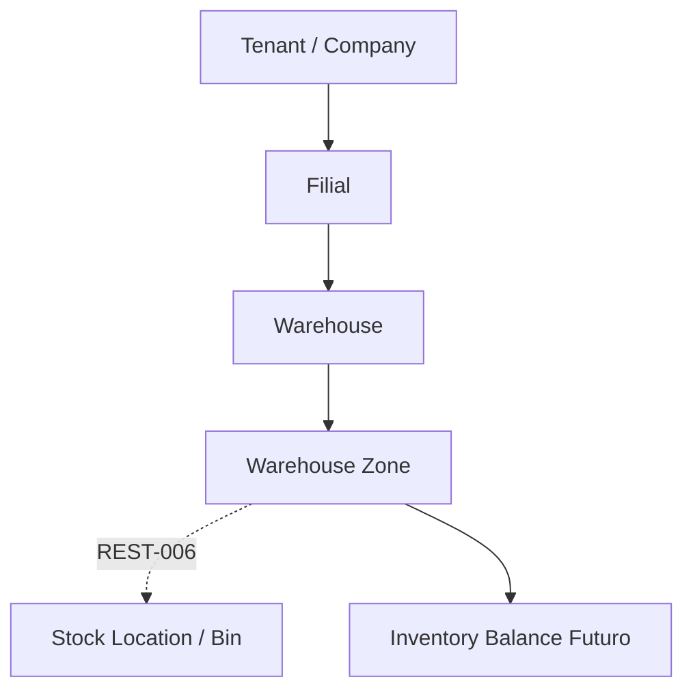

# Warehouse Zones

REST-005 implementa o cadastro de zonas dentro de um depósito.

Zone é o agrupador operacional entre `Warehouse` e futuras `Stock Locations`.

Exemplos:

- Recebimento;
- Armazenagem;
- Produção;
- Câmara Fria;
- Picking;
- Expedição;
- Quarentena;
- Vitrine;
- Reserva.

## Escopo

Implementado:

- CRUD de zonas;
- ativação e desativação;
- ordenação por `sort_order`;
- soft delete;
- auditoria;
- API com envelope padrão;
- telas Flutter para lista, cadastro, edição e detalhe;
- dados demo para restaurante e varejo.

Fora do escopo:

- Stock Locations;
- entrada de mercadoria;
- transferência entre depósitos;
- leitura de QR Code;
- código de barras.

## Regras

- Toda zona pertence a um tenant, filial e depósito.
- O backend resolve tenant e filial ativa pelo usuário autenticado.
- O frontend informa apenas o `warehouse_id`.
- O depósito precisa pertencer ao tenant e à filial ativa.
- O depósito precisa estar ativo para receber novas zonas.
- `code` é único por tenant e depósito entre zonas não removidas.

## Tipos

- `receiving`;
- `shipping`;
- `storage`;
- `production`;
- `quarantine`;
- `picking`;
- `display`;
- `other`.

## Flags Operacionais

As flags permitem preparar filtros futuros sem acoplar a UI a um único segmento:

- `is_receiving`;
- `is_shipping`;
- `is_storage`;
- `is_production`;
- `is_quarantine`.

## Fluxo

