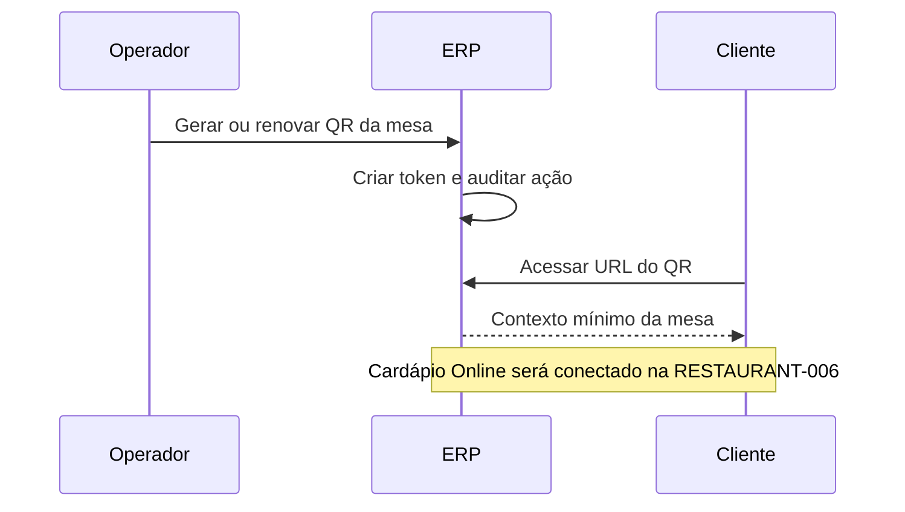

# QR Codes das Mesas

O QR da mesa é uma porta de entrada pública e limitada para a operação do restaurante. Ele não autentica clientes nem operadores e não carrega dados internos: aponta para um token aleatório que identifica somente uma mesa ativa.

## Decisão técnica

O backend gera um token criptograficamente aleatório para cada mesa. O token pode ser rotacionado e o anterior deixa de funcionar. A consulta pública responde apenas número, nome opcional e estado ativo da mesa.

Esse limite evita vazamento de contexto multi-tenant e permite que a RESTAURANT-006 conecte o Cardápio Online sobre a mesma URL, sem reimprimir todas as etiquetas.

## Fluxo

Impressão física, roteamento de cozinha e leitura por câmera pertencem a tarefas posteriores.
